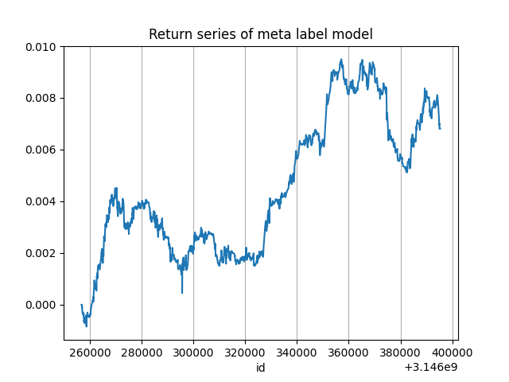

# Quantitative Finance #

This repository includes the implementation of Chapters 2 and 3 from the book "Advances in Financial Machine Learning".

## Chapter 2: Financial Data Structures ##
The implementation includes regular bars, imbalance bars, run bars, and the cumulative sum filter. The analysis includes tests of normality, stationarity, and serial correlation.

Normality tests are based on the Kolmogorov-Smirnov (KS) and Jarque-Bera tests, as the Shapiro-Wilk test is not accurate for large samples.
Stationarity tests are based on the Augmented Dickey-Fuller (ADF) test.
Autocorrelation Function (ACF) Plots
The following ACF plots represent the log returns.

ACF Plot for Log Returns (Tick Frequency):

ACF Plot for Log Returns (Daily Frequency):

Cumulative Sum Filter created statistically significant correlations between Binance cash net flow data, balances count, and Bitcoin log return.

### Normality Improvement ###

After applying the Cumulative Sum Filter, the normality of the sample improved. The following plots demonstrate the improvement:

## Chapter 3: Labeling and Meta-Labeling ##
The implementation includes labeling whether a sample reaches profit-taking, stop-loss levels, or expiry using the Triple Barrier method. It uses the primary model to pick a side for each sample and meta-labeling to determine the bet size.

 
Precision , Recall and F1 scores for the primary model and the secondary model
F1 scores increases for secondary model, as expected.

 

The example above shows a return series based on prediction on test data, containing overlapping samples due to the Triple Barriers method.

It is found later that the concurrency of the above sampling is very low, with median concurrency(overlapping) of 0

After concurrency is fixed, the return series looks like this:

 

However, boundary of testing data is re-adjusted to match with sample weights boundaries
The return series now looks like this:

 

Caution : Any return series above is not the actual return series, every sample might overlap with each other.  

 
After increasing max_depth of the secondary model to 10, the return series looks like this.  

Unfortunately, if commissions of 0.1% are taken into account, this strategy is not profitable.  

### Sample weighting ###
The sample weights are calculated as follows:  
sum of returns / concurrency in terms of tick over the period from the start of sample to profit-taking/stop-loss/expiry 
multiply by the cumulative uniqueness decay factor 

Weighted bootstrapping is then performed with this sample weights.  
Originally, sequential bootstrapping is used, but it soon becomes apparent that my laptop cannot handle the memory consumption.  
Bagging is performed with 6 models, each with 1000 trees and a maximum depth of 10. (same as previous model),  
since average weighting is around .17.

 
With bagging, the return series looks like this.  
The mean of return increases slightly, in order of magnitude of 10^-8.  
Which is not enough to cover the commissions.  

### Summary ###
The **primary model** is a simple cross moving average model with a *100-ticks vs 1000-ticks* window,  
while the **secondary model** is a Random Forest model with *1000 trees and a maximum depth of 5*.  

Although commissions are not taken into account , considering the simplicity of both models,  
it is quite surprising that they can generate any **profit** at all.