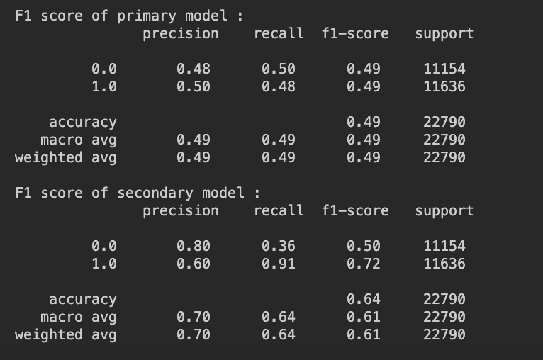
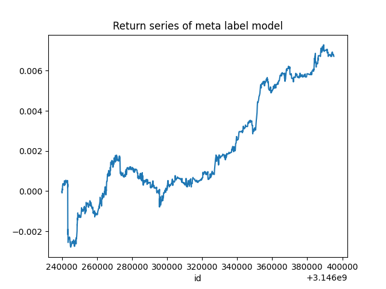
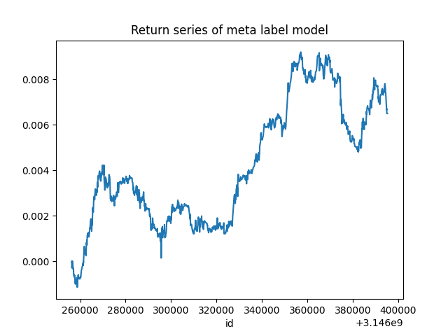
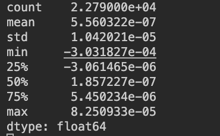
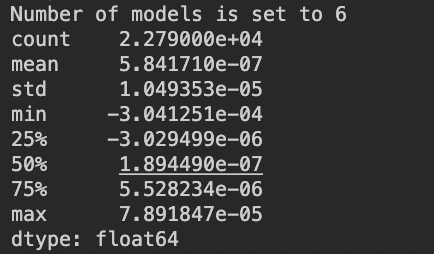
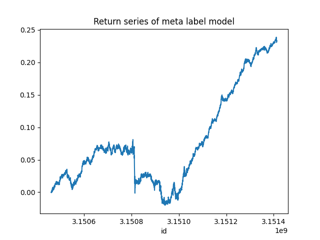
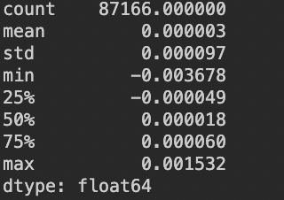
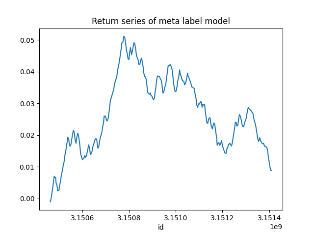
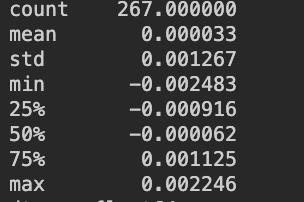

# Advanced Quantitative Finance Techniques

In this repository, I provide a thorough implementation of various advanced quantitative finance techniques. These methods include Information-driven Bars, Cumulative Sum Filter, Triple Barriers Method, Meta-labeling, Sample Weighting, and Sequential Weighted Bagging. The data used in this project are Binance cash flow and Bitcoin balance counts for the Cumulative Sum Filter, and Bitcoin tick data for other techniques.

## Financial Data Structures and Statistical Analysis

The library I created includes a variety of financial data structures such as regular bars, imbalance bars, run bars, and the Cumulative Sum Filter. The statistical analysis procedures I implemented consist of tests for normality (using Kolmogorov-Smirnov (KS) and Jarque-Bera tests), stationarity (using the Augmented Dickey-Fuller (ADF) test), and serial correlation (using Autocorrelation Function (ACF) Plots for log returns).

After applying the Cumulative Sum Filter, I observed a significant correlation between the Binance cash net flow data, balances count, and Bitcoin log return. Moreover, there was a noticeable improvement in sample normality. (details in plots folder)

## Trade Labeling, Meta-Labeling, and Predictive Modeling

The implementation includes a systematic labeling approach using the Triple Barrier method. Here, the primary model selects a side for each sample and meta-labeling determines the bet size.

The image above displays the Precision, Recall, and F1 scores for both the primary and secondary models. As expected, an increase in F1 scores for the secondary model was seen. However, the return series may contain overlapping samples due to the Triple Barriers method.

By increasing the max_depth of the secondary model to 10, the mean return reached 5.56e-7. It's important to note that this strategy is not profitable when considering a 0.1% commission.

## Sample Weighting, Bagging, and Performance Evaluation

I computed sample weights based on the sum of returns, concurrency (in terms of tick over the period from the start of sample to profit-taking/stop-loss/expiry), and the cumulative uniqueness decay factor.

Initially, I performed weighted bootstrapping with these sample weights. However, due to high memory consumption, bagging is performed instead. Despite showing a slight increase in mean return with bagging, the return series is not sufficient to cover commissions.

## Data Consolidation and Model Calibration

To reduce the number of trades (and consequently, commissions), I consolidated 5 days of tick data into one sample. This approach, however, created challenges with the Triple Barriers method, particularly with the horizontal and vertical barriers. After addressing these issues, the mean return improved(3e-6) but remained insufficient to cover commissions.

For a longer interval, though the mean return improved to 3e-4, my results suggest that the current strategy may be too risky or that the model may not be adequately trained due to lack of data.

## Conclusion and Future Directions

The primary model I utilized is a simple cross moving average model with specific tick windows, and the secondary model employs a Random Forest model with set maximum depth and number of trees. While I didn't make considerations for commissions, it's noteworthy that these simple models can still manage to generate profits. Nevertheless, the results underscore the importance of proper data handling, model selection, hyperparameter tuning in quantitative finance, and the consideration of trading costs. Future improvements will focus on refining these parameters and exploring more robust modeling techniques.